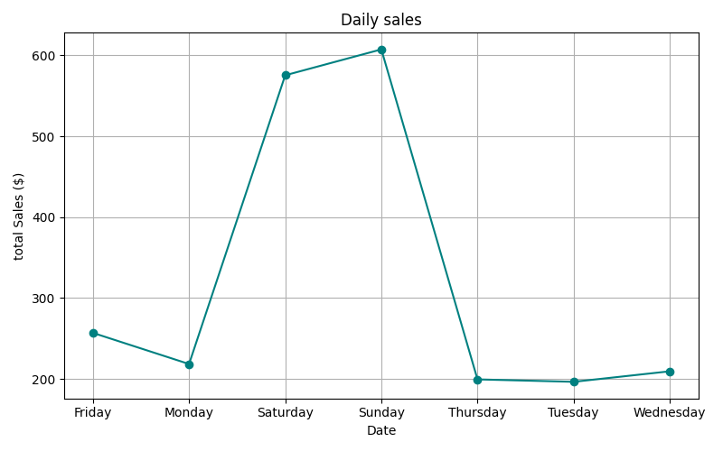
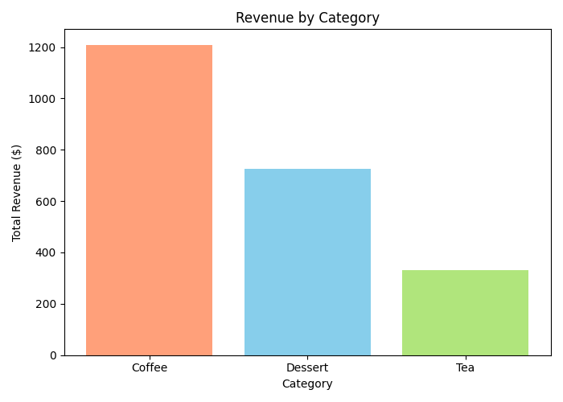

# Simple-Cafe-Data-Insights
Welcome to Simple Cafe Data Insights, a beginner-friendly data analysis project based on a fictional cafe's order history.
This project explores how a small cafe gain meaningful business insights using **Excel**, **Python (Pandas & Matplotlib)**, and **data visualisation techniques**.

# Project Goals
- Understand customer purchasing behaviour.
- Analyse categorised revenue trends.
- Identify best-selling menu.
- Visualise time-based sales trends.

# Tools used
- **Microsoft Excel**: Sample data creation, Pivot tables, charts, formula-based analysis.
- **Python**: Pandas, visualisation with Matplotlib.

## Sample Visualisations

